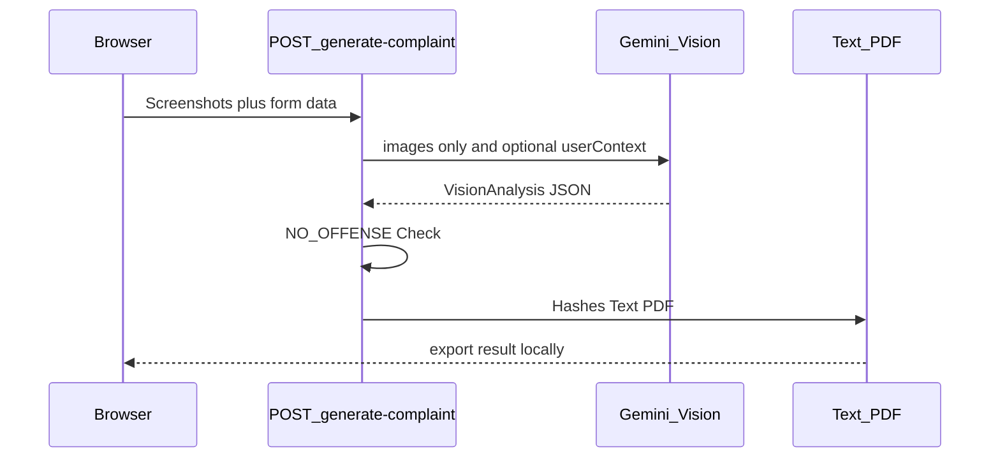

# HassMelden

Deutsch: [README.md](README.md)

HassMelden turns screenshots of online hate into a German **criminal complaint and request for prosecution** (*Strafanzeige & Strafantrag*) as a PDF, copyable text, and optional `.eml` export — for filing via Online-Wache and platform reporting channels.

## Principle: Zero-Persistence

- No server-side storage of screenshots, complainant, or incident data
- No database, and the app never sends anything to the police or platforms
- The AI (Google Gemini) sees **only** the screenshots and optional free text — no complainant data
- Complainant data can optionally be stored locally in the browser (`localStorage`)

## Prerequisites

- Node.js 18+ (recommended: current LTS)
- npm
- Google Gemini API key ([Google AI Studio](https://aistudio.google.com/apikey))

## Quick start

```bash
npm install
cp .env.example .env.local
```

Set the key in `.env.local`:

```env
GEMINI_API_KEY=your_key_here
```

```bash
npm run dev
```

Open the app: [http://localhost:3000](http://localhost:3000)

## API key

| | |
|---|---|
| Variable | `GEMINI_API_KEY` |
| File | `.env.local` (local; not committed) |
| Template | [.env.example](.env.example) |
| Visibility | **server-side only** — no `NEXT_PUBLIC_` prefix |
| Source | [aistudio.google.com/apikey](https://aistudio.google.com/apikey) |

Without a key, `/api/generate-complaint` responds with HTTP 503 (`AI_UNAVAILABLE`).

## Architecture (short)



Details: [docs/TECHNISCHE-DOKUMENTATION.md](docs/TECHNISCHE-DOKUMENTATION.md) (German)

## Scripts

| Command | Purpose |
|---------|---------|
| `npm run dev` | Development server |
| `npm run build` / `npm start` | Production build / start |
| `npm test` | Backend tests (Vitest) |
| `npm run test:watch` | Tests in watch mode |
| `npm run lint` | ESLint |

Test overview: [tests/README.md](tests/README.md) (German)

## Documentation

- [Technical documentation](docs/TECHNISCHE-DOKUMENTATION.md) (German) - architecture, API, AI pipeline, privacy
- [Backend tests](tests/README.md) (German)
- [License](LICENSE)

## License

This repository is licensed under the [PolyForm Noncommercial License 1.0.0](LICENSE). Noncommercial use, study, and sharing are permitted; commercial use is not. See the license text for the full terms.

## Disclaimer

HassMelden is **not legal advice**. The AI classification is a preliminary screening. Users review the content and file the complaint themselves with the police or the platform. The app does not send anything.
