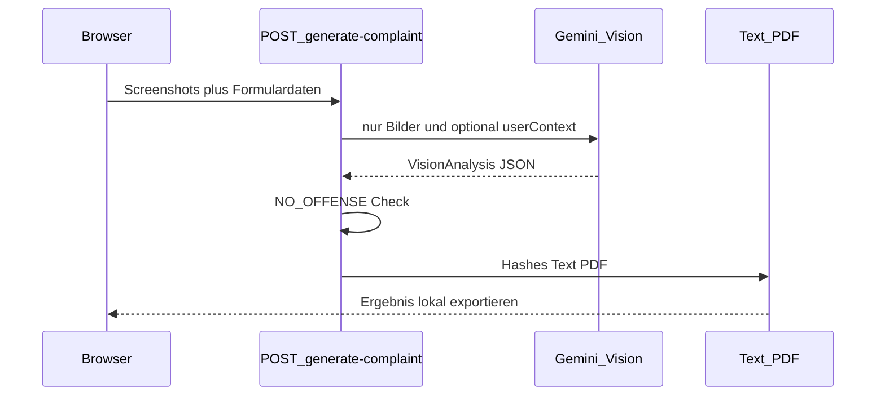

# HassMelden

English: [README.en.md](README.en.md)

HassMelden erzeugt aus Screenshots von Online-Hass eine deutsche **Strafanzeige & Strafantrag** als PDF, Kopiertext und optionaler `.eml`-Export – für die Weitergabe an Online-Wache und Plattform-Meldewege.

## Prinzip: Zero-Persistence

- Keine serverseitige Speicherung von Screenshots, Absender- oder Vorfallsdaten
- Keine Datenbank, kein Versand an Polizei oder Plattformen durch die App
- Die KI (Google Gemini) sieht **nur** die Screenshots und optionalen Freitext – keine Absenderdaten
- Optional können Absenderdaten lokal im Browser (`localStorage`) gespeichert werden

## Voraussetzungen

- Node.js 18+ (empfohlen: aktuelle LTS)
- npm
- Google Gemini API-Key ([Google AI Studio](https://aistudio.google.com/apikey))

## Schnellstart

```bash
npm install
cp .env.example .env.local
```

In `.env.local` den Key eintragen:

```env
GEMINI_API_KEY=dein_schlüssel_hier
```

```bash
npm run dev
```

App öffnen: [http://localhost:3000](http://localhost:3000)

## API-Key

| | |
|---|---|
| Variable | `GEMINI_API_KEY` |
| Datei | `.env.local` (lokal; wird nicht committed) |
| Vorlage | [.env.example](.env.example) |
| Sichtbarkeit | **nur serverseitig** – kein `NEXT_PUBLIC_`-Präfix |
| Quelle | [aistudio.google.com/apikey](https://aistudio.google.com/apikey) |

Ohne Key antwortet `/api/generate-complaint` mit HTTP 503 (`AI_UNAVAILABLE`).

## Architektur (Kurz)



Details: [docs/TECHNISCHE-DOKUMENTATION.md](docs/TECHNISCHE-DOKUMENTATION.md)

## Scripts

| Befehl | Zweck |
|--------|--------|
| `npm run dev` | Entwicklungsserver |
| `npm run build` / `npm start` | Production Build / Start |
| `npm test` | Backend-Tests (Vitest) |
| `npm run test:watch` | Tests im Watch-Mode |
| `npm run lint` | ESLint |

Testübersicht: [tests/README.md](tests/README.md)

## Dokumentation

- [Technische Dokumentation](docs/TECHNISCHE-DOKUMENTATION.md) – Architektur, API, KI-Pipeline, Datenschutz
- [Backend-Tests](tests/README.md)
- [Lizenz](LICENSE)

## Lizenz

**PolyForm Noncommercial License 1.0.0** – kostenlose Nutzung für nicht-kommerzielle Zwecke. **Kommerzielle Nutzung ist nicht erlaubt**, außer nach gesonderter Absprache mit den Rechteinhaber:innen. Siehe [LICENSE](LICENSE).

## Disclaimer

HassMelden ist **keine Rechtsberatung**. Die KI-Einordnung ist eine vorläufige Vorprüfung. Nutzer:innen prüfen den Inhalt und reichen die Anzeige selbst bei Polizei bzw. Plattform ein. Die App versendet nichts.
