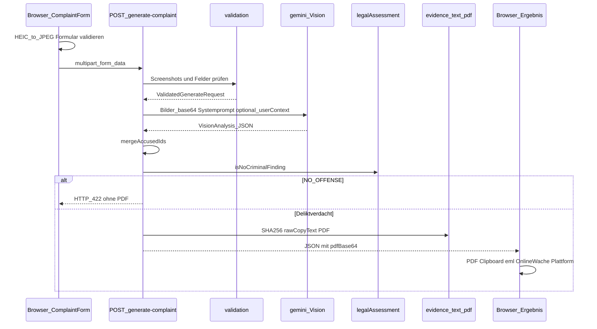

# HassMelden - Technische Dokumentation

HassMelden erzeugt aus Screenshots von Online-Hass eine deutsche **Strafanzeige & Strafantrag** (PDF, Kopiertext, `.eml`). Architekturprinzip: **Zero-Persistence** - keine serverseitige Speicherung von Nutzerdaten, keine Protokollierung von Inhalten, kein Versand an Behörden oder Plattformen durch die App.

| | |
|---|---|
| Stack | Next.js 14 (App Router), TypeScript, Tailwind CSS |
| KI | Google Gemini Vision via `@google/generative-ai` (aktuell `gemini-3.6-flash`, mit Fallback-Kandidaten) |
| PDF | PDFKit (Node.js) |
| Tests | Vitest (`npm test`) |
| Laufzeit API | `nodejs` (nicht Edge), `force-dynamic` |
| Lizenz | PolyForm Noncommercial 1.0.0 (siehe [LICENSE](../LICENSE)) |

Setup und API-Key: [README.md](../README.md).

---

## Inhaltsverzeichnis

1. [Überblick & Datenfluss](#1-überblick--datenfluss)
2. [Frontend](#2-frontend)
3. [Backend](#3-backend)
4. [KI-Pipeline im Detail](#4-ki-pipeline-im-detail)
5. [Nachverarbeitung (ohne KI)](#5-nachverarbeitung-ohne-ki)
6. [Datenschutz & Grenzen](#6-datenschutz--grenzen)
7. [Dateiübersicht](#7-dateiübersicht)
8. [Umgebungsvariablen & Setup](#8-umgebungsvariablen--setup)

---

## 1. Überblick & Datenfluss



**Wichtig:** Die KI sieht **nur** die Screenshot-Bilder und den optionalen Freitext `userContext`. Absenderdaten (Name, Adresse, E-Mail), Plattformwahl, Tatzeit und URLs gehen **nicht** in den Gemini-Request - sie fließen erst danach in Text/PDF.

---

## 2. Frontend

### 2.1 Einstieg & Seiten

| Route | Komponente | Zweck |
|-------|------------|--------|
| `/` | `app/page.tsx` → `ComplaintForm` | Haupt-Wizard |
| `/dashboard` | `DashboardView` | Demo-Analytics (Dummy-Daten) |

Navigation: `SiteNav` (Home / Dashboard).

### 2.2 Wizard (`ComplaintForm.tsx`)

Sechs Schritte:

| Step | Label | Inhalt |
|------|--------|--------|
| 0 | Start | Einleitung: Ablauf, Zero-Persistence, Disclaimer |
| 1 | Beweise | Bis zu 5 Screenshots, Drag & Drop, Lightbox, HEIC-Hinweis |
| 2 | Vorfall | Plattform, Tatzeit (`TT.MM.JJJJ, HH:mm`), Profil-URL, Account-ID, Kontext |
| 3 | Absender | Name, Straße, PLZ, Ort, Schutzmodus, E-Mail, optional localStorage |
| 4 | Prüfen | Zusammenfassung + Generieren; bei `NO_OFFENSE` Hinweisbanner |
| 5 | Ergebnis | PDF, Kopiertexte, Online-Wache, Plattform-Meldung, `.eml`, Hashes |

Validierung erfolgt **schrittweise** clientseitig; vor dem API-Call zusätzlich Schritte 1-3.

### 2.3 Bildvorbereitung (`utils/imageHandler.ts`)

Vor dem Upload:

1. Erkennung von HEIC/HEIF (MIME oder Dateiendung).
2. Clientseitige Konvertierung mit `heic2any` → JPEG (Qualität 0,85).
3. Whitelist: `image/png`, `image/jpeg`, `image/webp`.
4. Max. **10 MB** pro Datei.
5. Preview via `URL.createObjectURL` (muss vom Caller revoked werden).

HEIC kommt **nie** unverändert an die API - Gemini und PDF erwarten PNG/JPEG/WEBP.

### 2.4 Request an die API

`FormData` (kein JSON-Body), Felder:

| Feld | Pflicht | Typ |
|------|---------|-----|
| `screenshots` | ja (1-5) | File(s), mehrfach gleicher Key |
| `platform` | ja | `X` \| `INSTAGRAM` \| `FACEBOOK` \| `TIKTOK` \| `OTHER` |
| `incidentDate` | ja | `YYYY-MM-DDTHH:mm` (intern; UI zeigt deutsches Datumsformat) |
| `complainant` | ja | JSON-String |
| `sourceUrl` | nein | URL |
| `profileUrl` | nein | URL |
| `accountId` | nein | String |
| `userContext` | nein | String, max. 4000 Zeichen |

`complainant`-JSON-Schema (Auszug):

```json
{
  "fullName": "…",
  "street": "…",
  "zip": "80331",
  "city": "München",
  "email": "…",
  "phone": "…",
  "addressDisclosure": "full | protected",
  "deliveryNote": "…"
}
```

Bei `addressDisclosure: "protected"` ist `deliveryNote` Pflicht (ladungsfähige Zustelladresse). Legacy-`zipCity` wird clientseitig beim Laden aus `localStorage` in `zip`/`city` aufgeteilt.

### 2.5 Antwort & lokale Exports

Erfolgsantwort (`success: true`) enthält u. a.:

- `pdfBase64` - Data-URL (`data:application/pdf;base64,…`)
- Analysefelder: `accusedHandle`, `profileUrl`, `accountId`, `extractedText`, `legalCategorization`, `incidentDescription`
- `rawCopyText` - fertiger Anzeigentext
- `screenshotHashes` - SHA-256 je Bild

Client-Aktionen im Ergebnis:

1. PDF herunterladen
2. Kurze Schilderung + vollständigen Sachverhalt kopieren (für Online-Wache)
3. Link zur **Online-Wache** (PLZ → Bundesland, `config/onlineWache.ts`)
4. Link zur **Plattform-Meldung** (`config/platformReports.ts`) + optional Profil öffnen
5. Optional `.eml` und Hash-Zusammenfassung

E-Mail: `utils/emailExport.ts` baut eine RFC-822-`.eml` mit Textkörper + PDF-Anhang - **nur Download**, kein SMTP.

### 2.6 Lokale Persistenz (nur Browser)

`hooks/useComplainantData.ts`: optional `localStorage` unter `HassMelden_user_data` für Absenderdaten (debounced). Screenshots und Vorfallsdaten werden dort **nicht** gespeichert. „Daten löschen“ leert Formular + Storage + Object-URLs.

### 2.7 Demo-Modus

`lib/demoScenarios.ts` + Seitenleiste: fiktive Screenshots/Felder (inkl. Positivbeispiel ohne Delikt), springt nach Laden auf Schritt „Prüfen“. Nur für Prototyping.

---

## 3. Backend

Alles relevante Backend liegt unter `app/api/` und `lib/` - kein separates Microservice, keine Datenbank.

### 3.1 Endpoint

```
POST /api/generate-complaint
Content-Type: multipart/form-data
```

`app/api/generate-complaint/route.ts`:

- `runtime = "nodejs"` (Buffer, PDFKit, Crypto)
- `dynamic = "force-dynamic"`

### 3.2 Pipeline in Reihenfolge

1. **`validateGenerateRequest(formData)`** (`lib/validation.ts`) - inkl. Sanitize von Nutzertexten
2. **`analyzeScreenshotsWithVision(...)`** (`lib/gemini.ts`) → `VisionAnalysis`
3. **`mergeAccusedIds(...)`** - Priorität Profil/ID: Nutzerangabe → KI → Heuristik aus Handle+Plattform
4. **`isNoCriminalFinding(...)`** (`lib/legalAssessment.ts`) - bei Negativbefund **Abbruch ohne PDF**
5. **SHA-256** je Screenshot (`lib/evidence.ts`)
6. **`buildRawCopyText`** (`lib/complaintText.ts`)
7. **`buildComplaintPdf`** (`lib/pdf.ts`) - bettet Originalbilder + Hashes ein
8. JSON-Response (kein Schreiben auf Disk)

### 3.3 Validierung (`lib/validation.ts`)

| Prüfung | Regel |
|---------|--------|
| Screenshots | ≥1, ≤5; MIME png/jpeg/webp; ≤10 MB; Buffer aus `arrayBuffer()` |
| Plattform | Enum `PLATFORMS` |
| `incidentDate` | Regex `^\d{4}-\d{2}-\d{2}T\d{2}:\d{2}$` |
| URLs | `http:` / `https:` via `URL` |
| `userContext` | ≤ 4000 Zeichen; Sanitize gegen Prompt-Injection |
| Absender | Pflichtfelder inkl. `zip` (5 Ziffern) + `city`; bei Schutzmodus `deliveryNote` |

Fehler → HTTP **400** / `VALIDATION_ERROR`.

### 3.4 Fehlercodes API

| HTTP | Code | Wann |
|------|------|------|
| 400 | `VALIDATION_ERROR` | Ungültige Eingabe |
| 422 | `NO_OFFENSE` | KI sieht keinen strafrechtlich relevanten Inhalt - **kein PDF** |
| 503 | `AI_UNAVAILABLE` | Kein Key, leere/ungültige Gemini-Antwort, API-Fehler |
| 500 | `INTERNAL_ERROR` | Sonstiges |

Bei `NO_OFFENSE` liefert die API optional `assessment` (Handle, Extrakt, Einordnung, Beschreibung) für die UI - ohne `pdfBase64`.

### 3.5 Merge der Beschuldigten-IDs

Nach der KI:

```
profileUrl = Nutzer-profileUrl
          || analysis.profileUrl
          || guessProfileUrl(platform, accusedHandle)

accountId  = Nutzer-accountId || analysis.accountId
```

`guessProfileUrl` (`lib/evidence.ts`) baut z. B. `https://x.com/{handle}` - nur Best-Effort, kein API-Call zur Plattform.

---

## 4. KI-Pipeline im Detail

Zentrale Datei: **`lib/gemini.ts`**. Sanitize: **`lib/sanitize.ts`**.

### 4.1 Was die KI bekommt - und was nicht

| Geht an Gemini | Geht **nicht** an Gemini |
|----------------|---------------------------|
| Screenshot-Binärdaten (Base64, inline) | Absendername, Adresse, E-Mail, Telefon |
| Optional: `userContext` (in `UNTRUSTED_USER_CONTEXT`-Wrapper) | `platform`, `incidentDate` |
| Systemprompt + Analyseanweisung | `sourceUrl`, `profileUrl`, `accountId` vom Formular |
| | SHA-256, PDF-Layout |

Absender und Vorfalls-Metadaten werden **nach** der Vision-Analyse in Text/PDF kombiniert.

### 4.2 Modellkonfiguration

```ts
const MODEL_CANDIDATES = ["gemini-3.6-flash"] as const;

genAI.getGenerativeModel({
  model: modelName,
  safetySettings: EVIDENCE_SAFETY_SETTINGS, // BLOCK_NONE für Beweismittel
  generationConfig: {
    temperature: 0.2,
    responseMimeType: "application/json",
  },
});
```

- API-Key: `process.env.GEMINI_API_KEY` (z. B. `.env.local`)
- Fehlt der Key → `AiUnavailableError` → 503
- Safety: Hass-/Beleidigungsinhalte als Beweismittel würden sonst vom Safety-Filter geblockt
- Bei Modell-404/Unavailable: nächster Eintrag in `MODEL_CANDIDATES` (Fallback-Liste erweiterbar)

### 4.3 Aufbau des Multimodal-Requests (`Parts`)

Gemini erhält ein Array von `Part`s - Text und Bilder:

```
[0] text: SYSTEM_PROMPT
         + optional UNTRUSTED_USER_CONTEXT-Block
         + "Analysiere die folgenden N Screenshot(s) … JSON …"

[1] text: "Screenshot 1 von N:"
[2] inlineData: { mimeType, data: base64 }
…
```

Die Bilder werden **in Upload-Reihenfolge** nummeriert. Encoding: `Buffer.toString("base64")` - inline, kein Cloud-Storage-Upload. Buffer bleiben nur im Request-Scope für PDF/Hashes.

### 4.4 Systemprompt - Aufgaben der KI

Rollenbeschreibung: juristischer Assistent DE-Strafrecht, Fokus digitale Hasskriminalität (§§ 185, 192a, 130, 241 StGB).

Explizite Aufgaben:

1. **Account-Handle** des Beschuldigten extrahieren  
2. **Profil-URL** und/oder **interne Account-ID**, falls im Bild sichtbar, sonst `null`  
3. **OCR / Originaltext** - bei mehreren Bildern zusammenhängenden Kontext  
4. **Sachliche Vorfallsbeschreibung** (nutzt ggf. `userContext`)  
5. **Rechtliche Einordnung** - Verdacht auf StGB-Paragrafen **oder** klare Negativ-Feststellung (kein Delikt)

Ausgabe **strikt als JSON** mit festen Keys:

```json
{
  "accusedHandle": "string",
  "profileUrl": "string|null",
  "accountId": "string|null",
  "extractedText": "string",
  "legalCategorization": "string",
  "incidentDescription": "string"
}
```

### 4.5 Response-Verarbeitung

1. `result.response.text()` lesen  
2. Leer → `AiUnavailableError`  
3. **`extractJson`:** zuerst `JSON.parse`; Fallback Regex auf JSON-Fences  
4. **`normalizeAnalysis`:** typisiertes `VisionAnalysis` inkl. Sanitize der Felder  

| Feld | Bei fehlendem/leerem Wert |
|------|---------------------------|
| `accusedHandle` | `"Unbekannt"` |
| `profileUrl` / `accountId` | `undefined` (auch bei Strings wie `"null"`, `"n/a"`, `"unbekannt"`) |
| `extractedText` | Hinweis „nicht vollständig gelesen“ |
| `legalCategorization` | Default Verdacht § 185 + manuelle Prüfung |
| `incidentDescription` | Hinweis, Sachverhalt manuell zu prüfen |

### 4.6 Legal Assessment (ohne erneuten KI-Call)

`lib/legalAssessment.ts` prüft `legalCategorization` heuristisch auf Negativbefunde („kein Anhaltspunkt…“, „nicht strafrechtlich…“ usw.). Trifft das zu → API **422 / `NO_OFFENSE`**, kein PDF.

### 4.7 Semantik der Analysefelder

| Feld | Verwendung |
|------|------------|
| `accusedHandle` | Beschuldigte:r in PDF/Text; Input für `guessProfileUrl` |
| `profileUrl` | Nach Merge in Dokumenten / Profil-Link im Ergebnis |
| `accountId` | Nach Merge in Dokumenten |
| `extractedText` | Block „Extrahierter Originaltext“ |
| `legalCategorization` | Block „Rechtliche Einordnung“ + NO_OFFENSE-Gate |
| `incidentDescription` | Block „Sachverhalt“ |

### 4.8 Was die KI bewusst *nicht* entscheidet

- Keine finale Rechtsberatung und kein „Schuldspruch“
- Keine Entscheidung über Absender-Schutzmodus
- Keine Hash-Berechnung und keine PDF-Gestaltung
- Kein Versand, kein Speichern

---

## 5. Nachverarbeitung (ohne KI)

### 5.1 Beweishashes (`lib/evidence.ts`)

```ts
sha256Hex(buffer) // Node crypto, Hex-String
```

Zeitstempel-Label: `formatEvidenceTimestamp()` mit Zeitzone `Europe/Berlin` - Zeitpunkt der **Generierung** in HassMelden.

### 5.2 Rohtext (`lib/complaintText.ts`)

Baut den vollständigen Anzeigentext inkl. Strafantragsklausel, Absenderblock (voll oder geschützt), Plattformdaten, KI-Felder, Hashes.

### 5.3 PDF (`lib/pdf.ts`)

- Titel **STRAFANZEIGE & STRAFANTRAG**
- Absender mit optionaler Adressschutz-Darstellung
- KI-Inhalte + Metadaten
- Pro Screenshot oft eigene Seite: Bild-Embed, SHA-256, Erfassungszeit
- Ausgabe: Buffer → Data-URL für den Client

### 5.4 Online-Wache & Plattform-Meldung

| Modul | Zweck |
|-------|--------|
| `config/onlineWache.ts` + `lib/onlineWache.ts` | PLZ → Bundesland → offizieller Online-Wache-Link |
| `config/platformReports.ts` + `lib/platformReports.ts` | Plattform → offizieller Meldeeinstieg (Deep-Link) |

Beide öffnen nur externe Portale; HassMelden sendet nichts.

---

## 6. Datenschutz & Grenzen

| Thema | Umsetzung |
|-------|-----------|
| Server-Persistenz | Keine DB, kein File-Write der Nutzerinhalte |
| Logs | Keine bewusste Protokollierung von Screenshot-/Absenderinhalten; in Dev ggf. KI-Fehlermeldung |
| KI-Anbieter | Bilder + optionaler Kontext gehen an die **Google Gemini API** |
| Absenderdaten | Nur in PDF/Text-Generierung im Request; nicht im Gemini-Prompt |
| Browser | Optional nur Absender in `localStorage` |
| Versand | App sendet nichts; `.eml` und Melde-Links sind lokal bzw. Deep-Links |
| Rechtliches | Kein Ersatz für Anwalt:in; Nutzer:in prüft und reicht selbst ein |

---

## 7. Dateiübersicht

```
app/
  page.tsx                          # Wizard-Seite
  dashboard/page.tsx                # Demo-Dashboard
  api/generate-complaint/route.ts   # Orchestrierung
  layout.tsx, globals.css

components/
  ComplaintForm.tsx                 # Wizard + API-Client
  SiteNav.tsx, DashboardView.tsx

config/
  onlineWache.ts                    # Online-Wache-URLs je Bundesland
  platformReports.ts                # Plattform-Meldelinks

hooks/
  useComplainantData.ts             # optional localStorage Absender

lib/
  types.ts                          # Shared Types & Limits
  validation.ts                     # multipart → ValidatedGenerateRequest
  sanitize.ts                       # Prompt-/Feld-Sanitize
  gemini.ts                         # Vision-Prompt, Request, Normalize
  legalAssessment.ts                # NO_OFFENSE-Heuristik
  evidence.ts                       # SHA-256, URL-Guess, Zeitstempel
  complaintText.ts                  # rawCopyText
  pdf.ts                            # PDFKit-Dokument
  onlineWache.ts                    # PLZ-Lookup
  platformReports.ts                # Plattform-Report-Resolver
  demoScenarios.ts, demoDashboardData.ts

utils/
  imageHandler.ts                   # HEIC, MIME, Preview
  emailExport.ts                    # .eml
  demoScreenshot.ts

tests/
  api/                              # Route-Tests (Gemini gemockt)
  unit/                             # Kernfunktionen
  helpers.ts, setup.ts, README.md
```

---

## 8. Umgebungsvariablen & Setup

| Variable | Pflicht | Beschreibung |
|----------|---------|--------------|
| `GEMINI_API_KEY` | ja (für Generierung) | Google AI Studio / Gemini API Key; nur in `.env.local` |

```bash
cp .env.example .env.local
# Key eintragen, dann:
npm run dev
```

Siehe auch [README.md](../README.md).

---

## Kurzfassung: KI-Datenweg

1. Browser konvertiert ggf. HEIC → JPEG und sendet 1-5 Bilder + optionalen Kontext.  
2. Server validiert MIME/Größe, sanitized Texte und liest Bytes in `Buffer`.  
3. `gemini.ts` packt Systemprompt + Kontext + nummerierte `inlineData`-Bilder in einen JSON-Mode-Call (temperature 0.2, Safety `BLOCK_NONE`).  
4. Antwort-JSON wird geparst, normalisiert und sanitized (`VisionAnalysis`).  
5. Nutzer-URLs/IDs überschreiben bzw. ergänzen KI-Extraktion.  
6. Negativbefund → `422 NO_OFFENSE` ohne PDF; sonst Text + PDF mit Hashes - ohne erneuten KI-Call.

Stand: Projektversion `0.1.0` (MVP).
